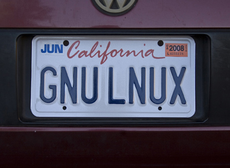

## Open Source is Everywhere

What, when and how

### Tales from devops

Notes:
* Who's actively using open source projects? Any particular examples/why?
* Anyone running open source projects? Tell us about it.
* Anyone not contributed to open source before?

---

<!-- .slide: data-background="#00AFFF" -->
## About me

* David Beitey
* @davidjb / @davidjb_
* Developer, Sys Admin, Enthusiast

---

<!-- .slide: data-background="#0066aa" -->
## Let's discuss!

(Ask questions, tell me I'm wrong,  
share your experiences etc)

---

## You've used open source

 <!-- .element: class="plain stretch" style="background: white;" -->

Notes:
* OS (Linux, FreeBSD, Android, OpenStack)
* Web (Firefox/Chromium, Apache, Nginx, Wikipedia, Wordpress, Drupal, Bootstrap)
* Apps, DBs and utilities (Open/LibreOffice, Postgres/MariaDB/MySQL)
* Programming (Node, Python, Ruby etc)

## Open source is...

Stuff released under terms that allow:
* Free sharing (*libre*)
* Reuse for any purpose
* Modification by anyone

Definitions differ on values (FSF vs OSI)

Notes:
* *Free software* vs *open source* differ on fundamental values (freedom of
  speech vs p2p development model)
* Free in terms of speech, not free as in beer
* Practical difference is small

## Open source != freeware

though it *can* cost money

Notes:
* Usually doesn't cost money (haven't see it yet)
* Definitely not shareware either

<!-- .slide: data-background-image="img/beer.jpg" -->
## Not just software

* Hardware (eg Arudino)
* Data (eg OpenStreetMap)
* Open-source recipes
* Beer & breweries

\+ much more

---

## My experience

Contribute to various projects  
(web, devops tools, etc)

Notes:
* Nginx, plugins
* CMS projects
* SaltStack, Docker

### One particular example

* **Early 2013**: started on nginx/Shibboleth auth

   <!-- .element: class="plain stretch" style="width: 200px;" -->
   <!-- .element: class="plain stretch" style="width: 200px;" -->

* **April 2013**: released initial integration code
  * Not formalised, quite hacky
  * Lots of comments from keen users
* **2013-2014**: minor updates, self-fixes

Notes:
* Long standing compatibility issue, essentially preventing the use of
  *anything* but Apache/IIS.
* nginx is a high-perf web server (+ proxy etc etc)
* Shibboleth underpins SSO in Universities/Institutions/federations worldwide
  and uses SAML
* Released as some code patches in a repo + docs

## Late one night, this turned up

Notes:
* **Nov 2014**: Luca (Debian project) reached out to help
* My response was a little `OTT`, but I was really stoked to have the help.

<!-- .slide: data-background-image="img/rainbow.jpg" -->
# :)

CC-BY Dominique Cappronnier  <!-- .element: class="attribution" -->

## ⏩ to 2016

* Worked to formalise code
* Shared GitHub organisation
* Now in use in dozens of Universities/orgs
* Bug reports, support requests
* PRs received

Notes:
* Exciting, but I'm not out to conquer the world.
* I'm stoked to be helping people solve the same problems I've had
* I'm excited to have their help because it's usually just me on this
* Which highlights why open source works...

---

## Why open source?

* Shoulders of giants
* Quality
* Freedom
* Community
* Price

Notes:
* Writing from scratch sucks. Might be interesting, but don't reinvent
  the wheel. Faster is better.
* Reusing projects typically means it's been battle-tested, especially for
  well worn code
  * Solves things you haven't thought of yet
  * Good for security etc
* Freedom: an open licence means you can extend, reuse etc the work. 
  * Some caveats with licensing: see later
  * Compare to a closed-source model; you can't even tell if it's working
    correctly without black-boxing.
  * I own a BT remote control car that's now unusable because the original dev
    didn't save his code or use VCS.  Oops.
* Community: typically open to discussion. Find an issue and be appreciated.
  * Build a community and have them help you too (2 way street)
  * Compare to closed orgs: security issues with local companies and get
    ignored/rejected/vilified.
* Price:  Python would take 286 years to develop and cost $16m

## Helps you

* Warm fuzzy feeling
* Skills + CV
* Public profile

Notes:
* Employers looking for contributors through GH profiles etc
* But that's not all...

---

<!-- .slide: data-background="#0066aa" -->
## Open source doesn't discriminate.

Notes:
* The joy of open source is that it doesn't discriminate.
* The code is there and it's available for anyone to do what they will with
  it.
* Not like proprietary licensing - no sharing, cost, etc
* This is why it's important to help.

---

## Getting involved

It takes all skills, not just devs.

Notes:
* Just using open source apps is a great start

* Use/test open source apps or projects
* Write docs or content
* Report bugs
* Contribute fixes
* Share your work / code
* Donate
* Evangelise

Notes:
* Financial member of the Python Software Foundation

<!-- .slide: data-background="#074" -->
## Starting out?

Begin with a real problem & think about:

* Pain points
* Help/documentation
* Problems/bugs
* New solutions

Notes:
* Could be either an existing O/S project or something new
* Start small and find your feet, skill up.
* Best if you've got a business need or non-hobby purpose
* Any other suggestions?
* You'll know the pain points of the software you're using
* Eventually you'll hit an unfixed bug or implement a new feature you need
* Or software that needs to be implemented

---

## Projects

* Every project is different
* Larger projects have contributor  
  guides & structure
* Be humble
* Accept criticism & rejection
* **Be professional**

Notes:
* Different projects: different ages, contributor experiences, management
  structures.  Anything particularly notable? (eg Foundations, NFP, etc)
* Have respect - it's a privilege that they're helping you, not a right.
* Not everyone will be professional back, don't stoop
* Don't take it to heart if your contribution is rejected

---

## Demo

Let's improve the docs for `Reveal.js`  
(this slide deck)

https://github.com/hakimel/reveal.js

Notes:
* Unclear docs as to what separators mean what
* Fixing on GitHub requires a GH account
* Only one file at a time TTW
* Click `Edit` and you can modify any file immediately
* GH forks the project for you so you can make a change locally
* If you have access to the project, you'll make the change directly
* <https://github.com/hakimel/reveal.js/compare/dev...davidjb:markdown-doc-fix>
* GitHub makes this process easy; many projects actively use mailing lists and
  patches etc
* Eventually, I'll hear back and social code platforms make it easy for anyone
  to comment and contribute (not just us)

---

## On the coding front

* Check the `develop` branch
* Reach out before big changes
* Send complete patches / PRs 
* Adhere to code style & guides
* Add tests where possible
  * Auto-testing (Continuous Integration) often used

 <!-- .element class="plain stretch" -->

Notes:
* Reach out for anything you're unsure about: bug report, feature suggestion,
  mailing list, stalk the developer on email, FB etc.
* "Tests are the way of convincing others your code *might* not suck"
* Learn about CI platforms (Travis is v. common)
* Licences and copyright are important

---

<!-- .slide: data-background-image="img/nutshell.jpg" -->
## Licences in a nutshell

> You get **copyright** on what you create and **license** it to others to use.

Licences grant specific rights and impose restrictions on re/use.

Notes:
* Not a lawyer!
* Some licences allow you to anything (MIT)
* Some require you to attribute in a certain way
* Some control what licence projects using it must have (GNU Public
  Licence/GPL)

## When contributing

* Check the `LICENSE` file
* Ensure you can use the project
* You may be required to assign your copyright to the project's owner
  (eg a Foundation)

## When open sourcing

* Consult [choosealicense.com](choosealicense.com) and
  [tldrlegal.com](https://tldrlegal.com)
* Think about your values
* Think about code reuse
* "Fun" licences (eg Beerware) might be harmful

Notes:
* Using something like the GPL means redistribution requires inclusion of
  derived code
* Prevents closed-source use of your code
* Fun licences usually aren't clear enough (eg beerware is unclear, doesn't
  limit liability etc)

---

## Making code open

*tl;dr*: just put it online w/ licence

* Set up repo & issue tracker (eg GitHub)
* Promote, but people will find you
* Ensure you have rights to open source
* No obligations to support your code
* Choose your licence carefully

 <!-- .element class="plain" style="height: 100px;" -->

Notes:
* You might need legal auth from your company
* No responsibility/obligation to provide support or time to anyone for your code
* LibVLC was relicensed from GPL to LGPL for allowing use in closed-source
  projects.  Involved getting permission from 450+ people throughout decades
  of development.
* Or rewrite their contributions
* Great post from Jean-Baptise Kempf of VLC about how he did it. "Stalking" is
  used.

<!-- .slide: data-background-image="img/fire.jpg" -->
### Running a project

* Clear licence and copyright
* Have contributor guidelines
* Be inviting and engage contributors
* Funding: Gittip, bounties, donations (if desired)
* **Communication is key**

Notes:
* Any other suggestions?
* You don't need to accept everything, but be helpful
* Any contribution might be someone's first
* Don't be a dick
* Engage thought interested, share your load.
* Let people prove themselves: eg my projects
* Too many projects die because of poor comms

---

## What's next?

Open source means freedom

Notes:
Don't like something? Change it!

---

1. Contribute your first fix (eg [mine](https://github.com/cherokee/web/pull/5))
1. Learn version control (Git)
1. Create code host profiles  
   (GitHub, BitBucket, GitLab)
1. Share your code
1. Read about licensing
1. Contribute in your own way
1. **Be professional**

Notes:
* If it's helped you, it'll probably help someone else
* If it's open somewhere like GitHub, you never know who's interested.

* Overall, it's a great feeling to know you're helping people.
* For me, the oddest sensation is that you'll never know how many people
  you've helped
* & the fact your contributions could be *anywhere* because open source is *everywhere*

---

<!-- .slide: data-background-image="img/open-sauce.jpg" -->
## Questions?

@davidjb / [davidjb.com](http://davidjb.com)

CC-BY Mark Skipper <!-- .element: class="attribution" -->

